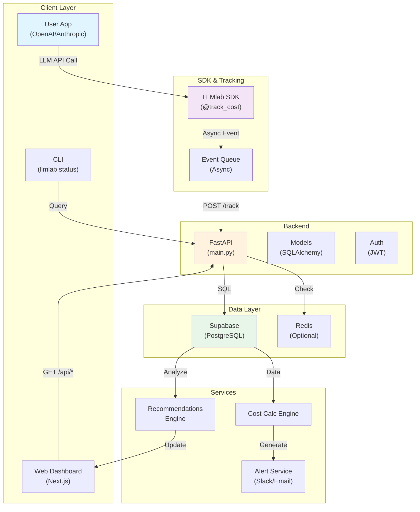
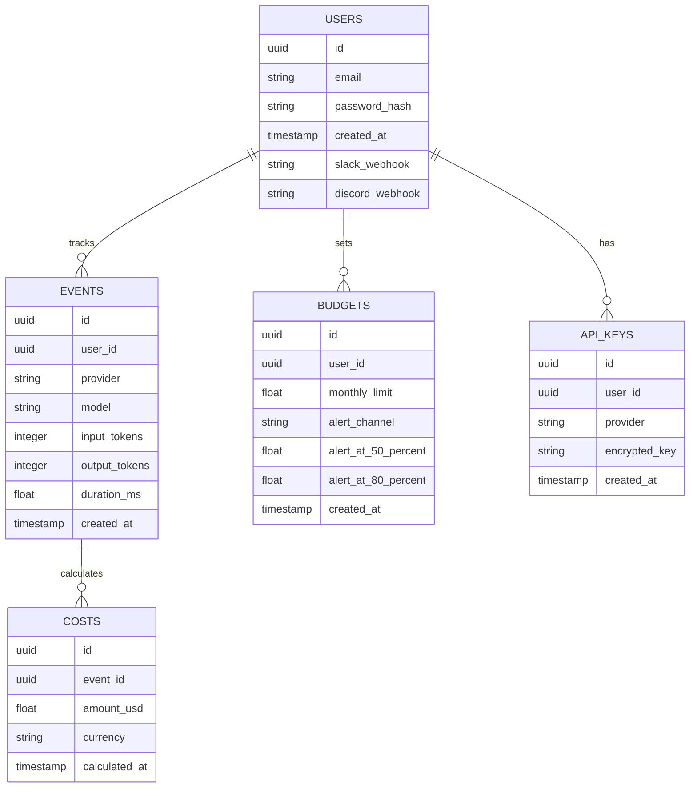
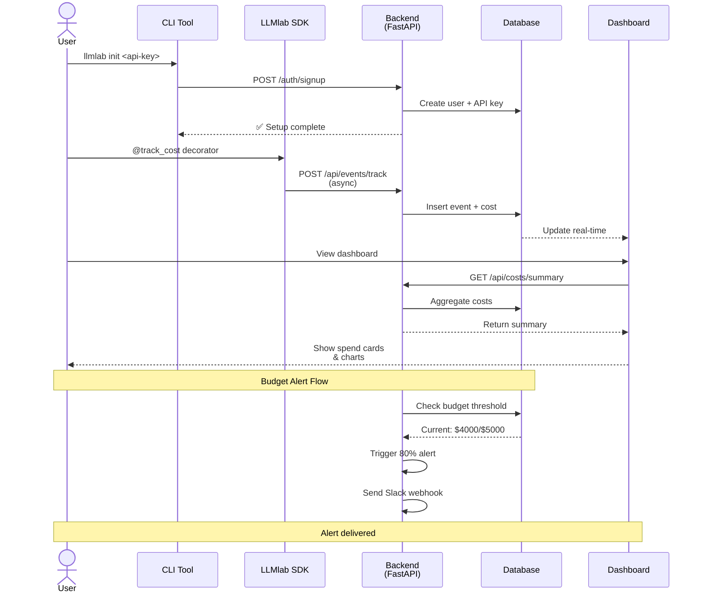
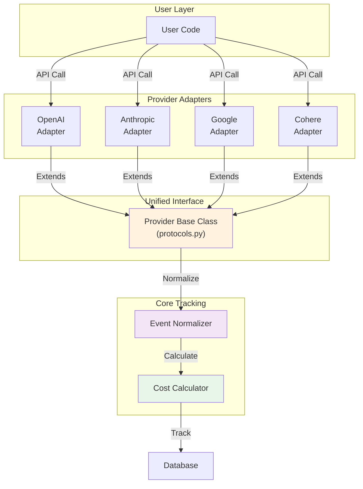
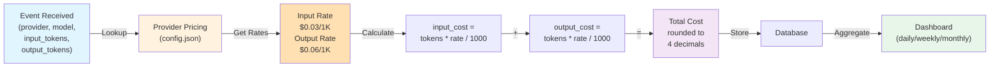
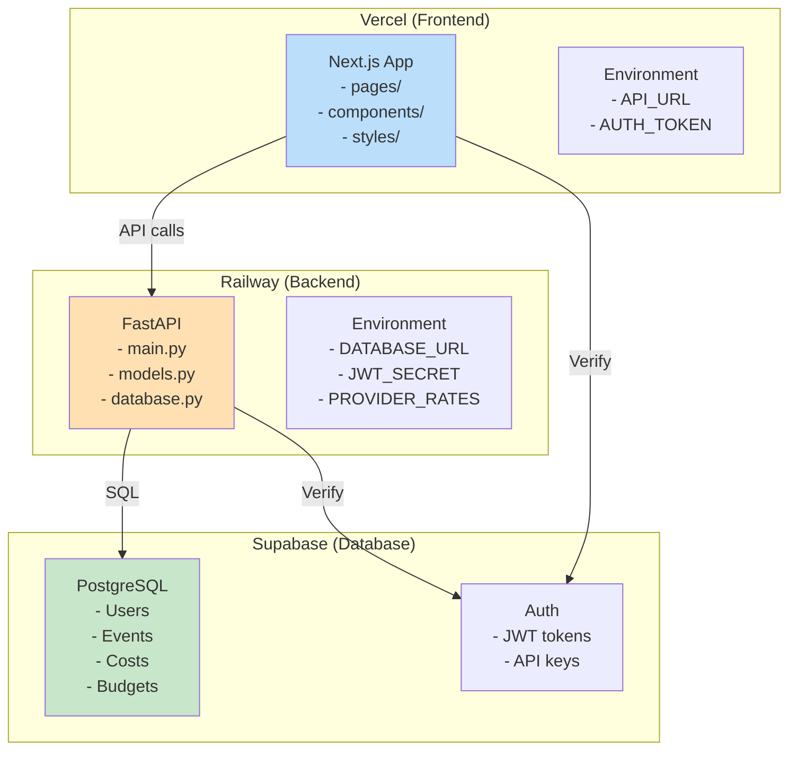

# LLMlab - Architecture Diagrams

## System Architecture

## Database Schema

## User Flow

## Event Tracking Flow

```mermaid
graph LR
    A["User Code:<br/>@track_cost decorator"] -->|Wrap LLM Call| B["Decorator Captures:<br/>- Model<br/>- Tokens<br/>- Duration<br/>- Cost"]
    B -->|Async Send| C["Event Queue<br/>(Non-blocking)"]
    C -->|HTTP POST| D["Backend API<br/>/api/events/track"]
    D -->|Validate| E["Schema Check<br/>(Pydantic)"]
    E -->|Calculate Cost| F["Cost Engine<br/>(Provider rates)"]
    F -->|Store| G["Database<br/>(PostgreSQL)"]
    G -->|Trigger| H["Alerts<br/>(Slack/Email/Webhook)"]
    H -->|Update| I["Dashboard<br/>(Real-time)"]
    
    style A fill:#e1f5ff
    style C fill:#fff3e0
    style D fill:#ffe0b2
    style G fill:#e8f5e9
    style I fill:#f3e5f5
```

## Provider Integration Pattern

## Cost Calculation Logic

## Deployment Architecture

---

**Key Design Principles:**
1. **Async-first** — Event tracking never blocks user code
2. **Extensible** — Easy to add new LLM providers
3. **Stateless backend** — Scale horizontally
4. **Real-time dashboard** — WebSocket or polling updates
5. **Privacy-first** — Users own their data, open-source auditable code
