# LLMLab System Architecture

Complete system design documentation with diagrams.

---

## System Architecture Diagram

```mermaid
graph TB
    subgraph Client["Client Layer"]
        Browser["🌐 React Browser App<br/>(Vercel)"]
        CLI["💻 Python CLI<br/>(PyPI Package)"]
        SDK["🐍 Python SDK<br/>(pip install)"]
    end
    
    subgraph API["API Gateway"]
        FastAPI["⚡ FastAPI Backend<br/>(Railway)"]
    end
    
    subgraph DB["Data Layer"]
        Postgres["🗄️ PostgreSQL<br/>(Supabase)"]
    end
    
    subgraph External["External Services"]
        Auth["🔐 Supabase Auth"]
        Email["📧 Email (Future)"]
    end
    
    Browser -->|HTTPS REST| FastAPI
    CLI -->|HTTPS REST| FastAPI
    SDK -->|HTTP POST| FastAPI
    
    FastAPI -->|SQL Queries| Postgres
    FastAPI -->|Auth Check| Auth
    FastAPI -->|Send Alerts| Email
    
    style Browser fill:#61affe
    style CLI fill:#61affe
    style SDK fill:#61affe
    style FastAPI fill:#90ee90
    style Postgres fill:#ffa500
    style Auth fill:#dda0dd
```



---

## User Flow Diagram

```mermaid
graph LR
    A["User"] -->|1. Sign Up| B["Create Account"]
    B -->|2. Get API Key| C["Receive llmlab_xxx"]
    C -->|3a. CLI: llmlab init| D["CLI Setup"]
    C -->|3b. Python: sdk.init()| E["SDK Setup"]
    C -->|3c. Web App| F["Login to Dashboard"]
    
    D -->|4. llmlab status| G["View Spend"]
    E -->|4. Track Costs| G
    F -->|4. Real-time Updates| G
    
    G -->|5. llmlab optimize| H["Get Recommendations"]
    F -->|5. View Recommendations| H
    
    style A fill:#e1f5ff
    style B fill:#fff9c4
    style C fill:#fff9c4
    style D fill:#c8e6c9
    style E fill:#c8e6c9
    style F fill:#c8e6c9
    style G fill:#ffe0b2
    style H fill:#f8bbd0
```

---

## Cost Tracking Flow


---

## Database Schema


---

## API Endpoint Hierarchy


---

## Deployment Architecture

```mermaid
graph TB
    subgraph Local["Developer Machine"]
        Code["GitHub Repo<br/>Push Code"]
    end
    
    subgraph CDN["CDN / Edge"]
        Vercel["📊 Vercel<br/>Frontend Distribution"]
    end
    
    subgraph Compute["Compute"]
        Railway["⚡ Railway<br/>FastAPI Backend"]
    end
    
    subgraph Data["Data"]
        Supabase["🗄️ Supabase<br/>PostgreSQL"]
    end
    
    subgraph Package["Package Registry"]
        PyPI["📦 PyPI<br/>Python Package"]
    end
    
    Code -->|git push| Vercel
    Code -->|git push| Railway
    Code -->|npm publish<br/>twine upload| PyPI
    
    Railway -->|SQL| Supabase
    Vercel -->|HTTPS| Railway
    
    User["👤 User"] -->|Web| Vercel
    User -->|CLI: pip install| PyPI
    User -->|CLI| Railway
    
    style Code fill:#e3f2fd
    style Vercel fill:#f3e5f5
    style Railway fill:#e8f5e9
    style Supabase fill:#fff3e0
    style PyPI fill:#fce4ec
    style User fill:#c8e6c9
```



---

## Request/Response Flow


---

## Cost Calculation Engine


---

## Recommendation Engine Logic


---

## Provider Extensibility Pattern


---

## CLI Command Flow


---

## Security & Auth Flow


---

**Diagrams above can be rendered as SVG/PNG using:**
- Mermaid Live Editor: https://mermaid.live
- GitHub Markdown (native support)
- Convert to image: `mmdc -i ARCHITECTURE.md -o ARCHITECTURE.pdf`

