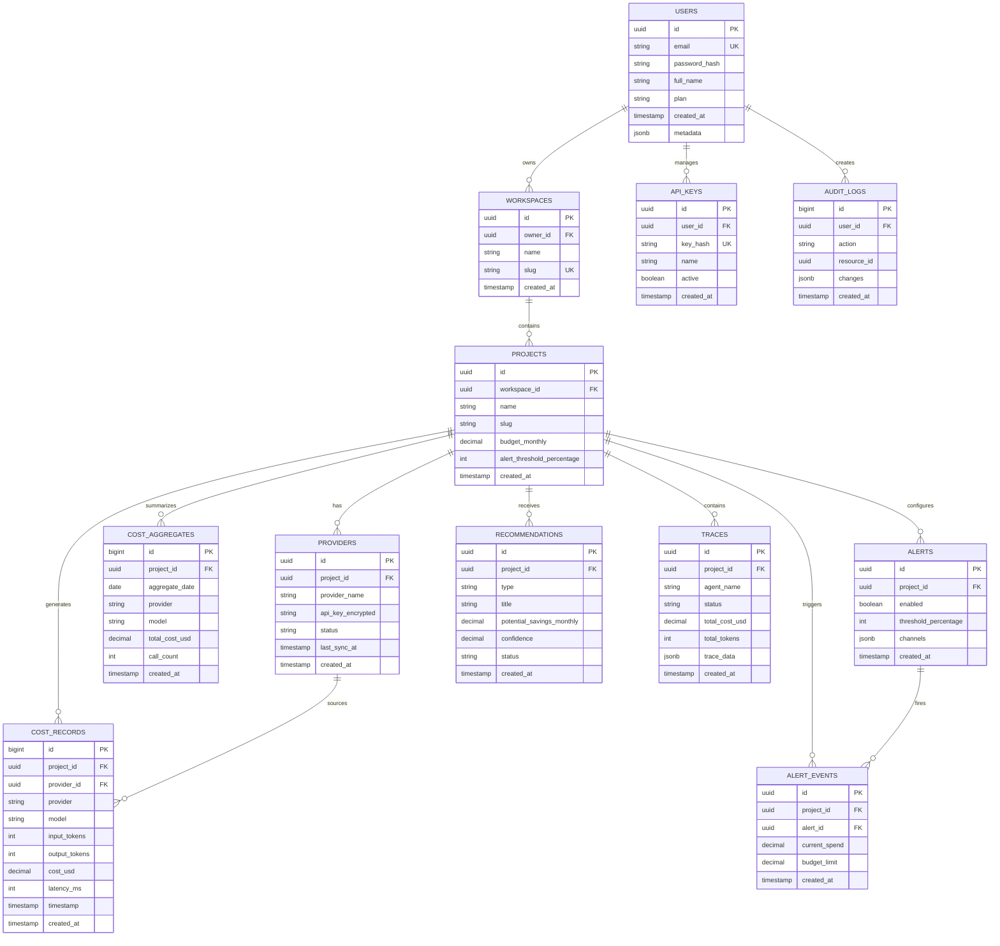

# LLMLab Database Schema

**Version:** 1.0 (Production-Ready)  
**Database:** PostgreSQL 14+  
**ORM:** SQLAlchemy 2.0  
**Migrations:** Alembic  

---

## SCHEMA OVERVIEW

The database is designed for:
- High-volume cost record ingestion (1M+ records/day)
- Fast cost aggregation queries
- Audit trail compliance
- Data isolation per project/user

**Core Tables:**
1. `users` — User accounts
2. `workspaces` — Team workspaces
3. `projects` — Projects (cost isolation)
4. `providers` — API credentials (encrypted)
5. `cost_records` — Individual API calls (time-series)
6. `cost_aggregates` — Pre-aggregated costs (for fast queries)
7. `alerts` — Budget alerts
8. `recommendations` — Optimization recommendations
9. `traces` — Agent execution traces (JSONB)
10. `api_keys` — API key management
11. `audit_logs` — Activity logging for debugging

---

## DETAILED SCHEMA

### 1. Users Table

```sql
CREATE TABLE users (
  id UUID PRIMARY KEY DEFAULT gen_random_uuid(),
  email VARCHAR(255) UNIQUE NOT NULL,
  password_hash VARCHAR(255) NOT NULL,  -- bcrypt
  full_name VARCHAR(255),
  plan VARCHAR(50) DEFAULT 'free',      -- free, pro, enterprise
  plan_expires_at TIMESTAMP,
  
  -- Profile
  avatar_url VARCHAR(512),
  bio TEXT,
  timezone VARCHAR(50) DEFAULT 'UTC',
  
  -- Status
  email_verified BOOLEAN DEFAULT false,
  active BOOLEAN DEFAULT true,
  
  -- Timestamps
  created_at TIMESTAMP DEFAULT CURRENT_TIMESTAMP,
  updated_at TIMESTAMP DEFAULT CURRENT_TIMESTAMP,
  last_login TIMESTAMP,
  
  -- Metadata
  metadata JSONB DEFAULT '{}'::jsonb
);

CREATE INDEX idx_users_email ON users(email);
CREATE INDEX idx_users_plan ON users(plan);
CREATE INDEX idx_users_active ON users(active);
```

### 2. Workspaces Table (Multi-Tenancy)

```sql
CREATE TABLE workspaces (
  id UUID PRIMARY KEY DEFAULT gen_random_uuid(),
  owner_id UUID NOT NULL REFERENCES users(id) ON DELETE CASCADE,
  
  name VARCHAR(255) NOT NULL,
  slug VARCHAR(255) UNIQUE,
  description TEXT,
  
  -- Settings
  billing_email VARCHAR(255),
  
  -- Status
  active BOOLEAN DEFAULT true,
  
  -- Timestamps
  created_at TIMESTAMP DEFAULT CURRENT_TIMESTAMP,
  updated_at TIMESTAMP DEFAULT CURRENT_TIMESTAMP,
  
  UNIQUE(owner_id, slug)
);

CREATE INDEX idx_workspaces_owner ON workspaces(owner_id);
CREATE INDEX idx_workspaces_slug ON workspaces(slug);
```

### 3. Projects Table

```sql
CREATE TABLE projects (
  id UUID PRIMARY KEY DEFAULT gen_random_uuid(),
  workspace_id UUID NOT NULL REFERENCES workspaces(id) ON DELETE CASCADE,
  
  -- Identity
  name VARCHAR(255) NOT NULL,
  slug VARCHAR(255) NOT NULL,
  description TEXT,
  
  -- Budget & Alerts
  budget_monthly DECIMAL(12, 2) DEFAULT 1000.00,
  alert_threshold_percentage INT DEFAULT 80,
  
  -- Status
  status VARCHAR(50) DEFAULT 'active',  -- active, archived, deleted
  
  -- Timestamps
  created_at TIMESTAMP DEFAULT CURRENT_TIMESTAMP,
  updated_at TIMESTAMP DEFAULT CURRENT_TIMESTAMP,
  
  UNIQUE(workspace_id, slug)
);

CREATE INDEX idx_projects_workspace ON projects(workspace_id);
CREATE INDEX idx_projects_status ON projects(status);
CREATE INDEX idx_projects_created ON projects(created_at DESC);
```

### 4. Providers Table (Encrypted API Keys)

```sql
CREATE TABLE providers (
  id UUID PRIMARY KEY DEFAULT gen_random_uuid(),
  project_id UUID NOT NULL REFERENCES projects(id) ON DELETE CASCADE,
  
  -- Provider info
  provider_name VARCHAR(50) NOT NULL,  -- openai, anthropic, azure, gemini
  name VARCHAR(255),  -- User-friendly name
  
  -- Credentials (encrypted at rest)
  api_key_encrypted VARCHAR(1024) NOT NULL,
  organization_id VARCHAR(255),  -- Optional, provider-specific
  metadata JSONB DEFAULT '{}'::jsonb,
  
  -- Status
  status VARCHAR(50) DEFAULT 'unverified',  -- unverified, verified, error
  error_message TEXT,
  
  -- Sync info
  last_sync_at TIMESTAMP,
  next_sync_at TIMESTAMP,
  
  -- Timestamps
  created_at TIMESTAMP DEFAULT CURRENT_TIMESTAMP,
  updated_at TIMESTAMP DEFAULT CURRENT_TIMESTAMP,
  
  CONSTRAINT valid_provider CHECK (provider_name IN ('openai', 'anthropic', 'azure', 'gemini', 'cohere', 'huggingface'))
);

CREATE INDEX idx_providers_project ON providers(project_id);
CREATE INDEX idx_providers_status ON providers(status);
CREATE INDEX idx_providers_next_sync ON providers(next_sync_at);
```

### 5. Cost Records Table (High-Volume Time-Series)

```sql
CREATE TABLE cost_records (
  id BIGSERIAL PRIMARY KEY,  -- Use BIGSERIAL for high volume
  project_id UUID NOT NULL REFERENCES projects(id) ON DELETE CASCADE,
  provider_id UUID REFERENCES providers(id) ON DELETE SET NULL,
  
  -- Provider info
  provider VARCHAR(50) NOT NULL,  -- Denormalized for query performance
  model VARCHAR(255) NOT NULL,
  
  -- Tokens & Cost
  input_tokens INT,
  output_tokens INT,
  total_tokens INT GENERATED ALWAYS AS (COALESCE(input_tokens, 0) + COALESCE(output_tokens, 0)) STORED,
  
  cost_usd DECIMAL(10, 6) NOT NULL,
  
  -- Request info
  api_call_id VARCHAR(255),  -- Provider's request ID
  user_id VARCHAR(255),      -- End user (optional)
  
  -- Performance
  latency_ms INT,
  
  -- Status
  status VARCHAR(50) DEFAULT 'success',  -- success, error, timeout
  error_message TEXT,
  
  -- Timestamp (critical for time-series queries)
  timestamp TIMESTAMP NOT NULL DEFAULT CURRENT_TIMESTAMP,
  
  -- Metadata
  metadata JSONB DEFAULT '{}'::jsonb,
  
  created_at TIMESTAMP DEFAULT CURRENT_TIMESTAMP
);

-- Indexes for efficient queries
CREATE INDEX idx_cost_records_project_timestamp ON cost_records(project_id, timestamp DESC);
CREATE INDEX idx_cost_records_provider ON cost_records(provider);
CREATE INDEX idx_cost_records_model ON cost_records(model);
CREATE INDEX idx_cost_records_timestamp ON cost_records(timestamp DESC);
CREATE INDEX idx_cost_records_api_call ON cost_records(api_call_id);

-- Partition for optimal performance (optional, for very high volume)
-- CREATE TABLE cost_records_2024_01 PARTITION OF cost_records
--   FOR VALUES FROM ('2024-01-01') TO ('2024-02-01');
```

### 6. Cost Aggregates Table (Pre-Aggregated for Speed)

```sql
CREATE TABLE cost_aggregates (
  id BIGSERIAL PRIMARY KEY,
  project_id UUID NOT NULL REFERENCES projects(id) ON DELETE CASCADE,
  
  -- Aggregation key
  aggregate_date DATE NOT NULL,  -- daily aggregate
  provider VARCHAR(50),
  model VARCHAR(255),
  
  -- Aggregated values
  total_cost_usd DECIMAL(12, 2),
  total_input_tokens BIGINT,
  total_output_tokens BIGINT,
  call_count INT,
  
  -- Performance
  avg_latency_ms INT,
  
  -- Status
  error_count INT,
  success_count INT,
  
  -- Metadata
  metadata JSONB DEFAULT '{}'::jsonb,
  
  created_at TIMESTAMP DEFAULT CURRENT_TIMESTAMP,
  updated_at TIMESTAMP DEFAULT CURRENT_TIMESTAMP,
  
  UNIQUE(project_id, aggregate_date, provider, model)
);

CREATE INDEX idx_cost_aggregates_project_date ON cost_aggregates(project_id, aggregate_date DESC);
CREATE INDEX idx_cost_aggregates_provider ON cost_aggregates(provider);
```

### 7. Alerts Table

```sql
CREATE TABLE alerts (
  id UUID PRIMARY KEY DEFAULT gen_random_uuid(),
  project_id UUID NOT NULL REFERENCES projects(id) ON DELETE CASCADE,
  
  -- Alert config
  enabled BOOLEAN DEFAULT true,
  threshold_percentage INT NOT NULL,
  
  -- Notification channels
  channels JSONB NOT NULL,  -- {email: true, slack: true, ...}
  slack_webhook_url VARCHAR(512),
  pagerduty_key VARCHAR(255),
  
  -- Status
  last_triggered_at TIMESTAMP,
  
  -- Timestamps
  created_at TIMESTAMP DEFAULT CURRENT_TIMESTAMP,
  updated_at TIMESTAMP DEFAULT CURRENT_TIMESTAMP
);

CREATE INDEX idx_alerts_project ON alerts(project_id);
```

### 8. Alert Events Table (Audit Trail)

```sql
CREATE TABLE alert_events (
  id UUID PRIMARY KEY DEFAULT gen_random_uuid(),
  project_id UUID NOT NULL REFERENCES projects(id) ON DELETE CASCADE,
  alert_id UUID REFERENCES alerts(id) ON DELETE SET NULL,
  
  -- Event info
  threshold_percentage INT NOT NULL,
  current_spend DECIMAL(12, 2) NOT NULL,
  budget_limit DECIMAL(12, 2) NOT NULL,
  
  -- Delivery
  channels_sent JSONB,  -- {email: true, slack: true, ...}
  status VARCHAR(50) DEFAULT 'sent',  -- sent, failed, bounced
  
  -- Timestamps
  created_at TIMESTAMP DEFAULT CURRENT_TIMESTAMP
);

CREATE INDEX idx_alert_events_project ON alert_events(project_id, created_at DESC);
```

### 9. Recommendations Table

```sql
CREATE TABLE recommendations (
  id UUID PRIMARY KEY DEFAULT gen_random_uuid(),
  project_id UUID NOT NULL REFERENCES projects(id) ON DELETE CASCADE,
  
  -- Recommendation info
  type VARCHAR(50) NOT NULL,  -- model_switch, prompt_optimization, caching
  title VARCHAR(255) NOT NULL,
  description TEXT,
  
  -- Impact analysis
  current_monthly_cost DECIMAL(12, 2),
  recommended_monthly_cost DECIMAL(12, 2),
  potential_savings_monthly DECIMAL(12, 2),
  potential_savings_percentage INT,
  
  -- Confidence
  confidence DECIMAL(3, 2),  -- 0.00 to 1.00
  data_points INT,  -- number of samples used in analysis
  reasoning TEXT,
  
  -- Impact assessment
  impact_assessment JSONB DEFAULT '{}'::jsonb,  -- accuracy, latency, reliability impact
  
  -- Status
  status VARCHAR(50) DEFAULT 'new',  -- new, applied, dismissed
  applied_at TIMESTAMP,
  dismissed_at TIMESTAMP,
  dismiss_reason VARCHAR(255),
  
  -- Timestamps
  created_at TIMESTAMP DEFAULT CURRENT_TIMESTAMP,
  updated_at TIMESTAMP DEFAULT CURRENT_TIMESTAMP
);

CREATE INDEX idx_recommendations_project ON recommendations(project_id);
CREATE INDEX idx_recommendations_status ON recommendations(status);
CREATE INDEX idx_recommendations_created ON recommendations(created_at DESC);
```

### 10. Traces Table (Agent Debugging)

```sql
CREATE TABLE traces (
  id UUID PRIMARY KEY DEFAULT gen_random_uuid(),
  project_id UUID NOT NULL REFERENCES projects(id) ON DELETE CASCADE,
  
  -- Trace info
  agent_name VARCHAR(255) NOT NULL,
  status VARCHAR(50) NOT NULL,  -- success, error, timeout
  
  -- Costs
  total_cost_usd DECIMAL(10, 6),
  total_tokens INT,
  input_tokens INT,
  output_tokens INT,
  
  -- Performance
  total_latency_ms INT,
  start_time TIMESTAMP,
  end_time TIMESTAMP,
  
  -- User context
  user_id VARCHAR(255),
  
  -- Full trace data (JSONB for flexibility)
  trace_data JSONB NOT NULL,  -- {steps: [...], metadata: {...}}
  
  -- Tagging
  tags JSONB DEFAULT '[]'::jsonb,
  
  -- Metadata
  metadata JSONB DEFAULT '{}'::jsonb,
  
  -- Timestamps
  created_at TIMESTAMP DEFAULT CURRENT_TIMESTAMP
);

CREATE INDEX idx_traces_project ON traces(project_id);
CREATE INDEX idx_traces_agent_name ON traces(agent_name);
CREATE INDEX idx_traces_status ON traces(status);
CREATE INDEX idx_traces_created ON traces(created_at DESC);
CREATE INDEX idx_traces_user ON traces(user_id);

-- Full-text search on trace content (optional)
-- CREATE INDEX idx_traces_content ON traces USING GIN(trace_data);
```

### 11. API Keys Table

```sql
CREATE TABLE api_keys (
  id UUID PRIMARY KEY DEFAULT gen_random_uuid(),
  user_id UUID NOT NULL REFERENCES users(id) ON DELETE CASCADE,
  
  -- Key info (hashed)
  key_hash VARCHAR(255) NOT NULL UNIQUE,
  key_prefix VARCHAR(20),  -- First 20 chars, for display
  name VARCHAR(255),
  
  -- Permissions
  permissions JSONB DEFAULT '[]'::jsonb,  -- ["read:costs", "write:projects", ...]
  
  -- Expiration
  expires_at TIMESTAMP,
  
  -- Status
  active BOOLEAN DEFAULT true,
  last_used TIMESTAMP,
  
  -- Timestamps
  created_at TIMESTAMP DEFAULT CURRENT_TIMESTAMP,
  updated_at TIMESTAMP DEFAULT CURRENT_TIMESTAMP
);

CREATE INDEX idx_api_keys_user ON api_keys(user_id);
CREATE INDEX idx_api_keys_hash ON api_keys(key_hash);
CREATE INDEX idx_api_keys_active ON api_keys(active);
```

### 12. Audit Logs Table (Compliance)

```sql
CREATE TABLE audit_logs (
  id BIGSERIAL PRIMARY KEY,
  user_id UUID REFERENCES users(id) ON DELETE SET NULL,
  
  -- Action
  action VARCHAR(255) NOT NULL,  -- created_project, deleted_api_key, etc.
  resource_type VARCHAR(50),     -- project, provider, recommendation
  resource_id UUID,
  
  -- Changes
  changes JSONB DEFAULT '{}'::jsonb,  -- {old: {...}, new: {...}}
  
  -- IP & User Agent
  ip_address INET,
  user_agent VARCHAR(512),
  
  -- Status
  status VARCHAR(50) DEFAULT 'success',  -- success, error
  error_message TEXT,
  
  -- Timestamp
  created_at TIMESTAMP DEFAULT CURRENT_TIMESTAMP
);

CREATE INDEX idx_audit_logs_user ON audit_logs(user_id);
CREATE INDEX idx_audit_logs_resource ON audit_logs(resource_type, resource_id);
CREATE INDEX idx_audit_logs_created ON audit_logs(created_at DESC);
```

---

## DATABASE SCHEMA DIAGRAM (Mermaid)



---

## PARTITIONING STRATEGY (For Scale)

For deployments with 1M+ cost records per day, use table partitioning:

```sql
-- Create partitioned table
CREATE TABLE cost_records (
  ...  -- same columns as above
) PARTITION BY RANGE (timestamp);

-- Create monthly partitions
CREATE TABLE cost_records_2024_01 PARTITION OF cost_records
  FOR VALUES FROM ('2024-01-01') TO ('2024-02-01');

CREATE TABLE cost_records_2024_02 PARTITION OF cost_records
  FOR VALUES FROM ('2024-02-01') TO ('2024-03-01');

-- Auto-create partitions with pg_partman
CREATE EXTENSION pg_partman;
SELECT create_parent('public.cost_records', 'timestamp', 'native', 'monthly');
```

---

## BACKUP & RECOVERY

### Backup Strategy

```bash
# Daily automated backups
pg_dump llmlab_db > llmlab_backup_$(date +%Y%m%d).sql

# Point-in-time recovery
pg_basebackup -D backups/ -F tar -z -P -v
```

### Recovery Procedure

```bash
# Restore from backup
psql llmlab_db < llmlab_backup_20240115.sql
```

---

## DATA RETENTION POLICY

```sql
-- Delete old cost records (data retention)
DELETE FROM cost_records 
WHERE created_at < CURRENT_DATE - INTERVAL '90 days'
AND project_id NOT IN (
  SELECT id FROM projects WHERE status != 'deleted'
);

-- Archive old traces (optional)
INSERT INTO traces_archive
SELECT * FROM traces WHERE created_at < CURRENT_DATE - INTERVAL '365 days';
```

---

## PERFORMANCE TUNING

### Query Optimization

```sql
-- Analyze tables regularly
ANALYZE cost_records;
ANALYZE cost_aggregates;

-- Vacuum to reclaim space
VACUUM ANALYZE cost_records;

-- Check query plans
EXPLAIN ANALYZE SELECT ... FROM cost_records WHERE project_id = '...' AND timestamp > NOW() - INTERVAL '7 days';
```

### Caching Strategy

```python
# Redis cache for frequently accessed queries
cache.set(
    key=f"project_costs:{project_id}:{date}",
    value=json.dumps(costs),
    ttl=3600  # 1 hour
)
```

---

## MIGRATION PROCEDURES

### Adding a New Column

```sql
-- 1. Add column with default (non-blocking)
ALTER TABLE cost_records ADD COLUMN new_field VARCHAR(255) DEFAULT 'value';

-- 2. Backfill data
UPDATE cost_records SET new_field = ... WHERE new_field IS NULL;

-- 3. Add constraints
ALTER TABLE cost_records ALTER COLUMN new_field SET NOT NULL;
```

### Alembic Migration

```python
# alembic/versions/001_initial_schema.py
from alembic import op
import sqlalchemy as sa

def upgrade():
    op.create_table(
        'cost_records',
        sa.Column('id', sa.BigInteger(), primary_key=True),
        sa.Column('project_id', sa.UUID(), nullable=False),
        # ... more columns
    )

def downgrade():
    op.drop_table('cost_records')
```

---

## SECURITY BEST PRACTICES

### Encryption at Rest

```python
# Use PgCrypto extension
from sqlalchemy import func

api_key_encrypted = func.encrypt(api_key, ENCRYPTION_KEY, 'aes-gcm')
```

### Row-Level Security (RLS)

```sql
-- Enable RLS on cost_records
ALTER TABLE cost_records ENABLE ROW LEVEL SECURITY;

-- Policy: Users can only see their project's data
CREATE POLICY cost_records_isolation ON cost_records
  USING (project_id IN (SELECT id FROM projects WHERE workspace_id IN (SELECT id FROM workspaces WHERE owner_id = current_user_id())));
```

### Audit Logging

```sql
-- Log all changes
CREATE TRIGGER audit_cost_records
AFTER INSERT OR UPDATE OR DELETE ON cost_records
FOR EACH ROW
EXECUTE FUNCTION log_audit();
```

---

## CONCLUSION

This schema is designed for:
- ✅ High-volume cost record ingestion
- ✅ Fast aggregation queries
- ✅ Multi-tenancy isolation
- ✅ Audit trail compliance
- ✅ Security (encryption at rest)
- ✅ Performance (indexes, partitioning)

For production deployments, ensure:
- Daily backups
- Query monitoring
- Connection pooling (PgBouncer)
- Read replicas for scaling

See `BACKEND_IMPLEMENTATION.md` for details on the application layer.
