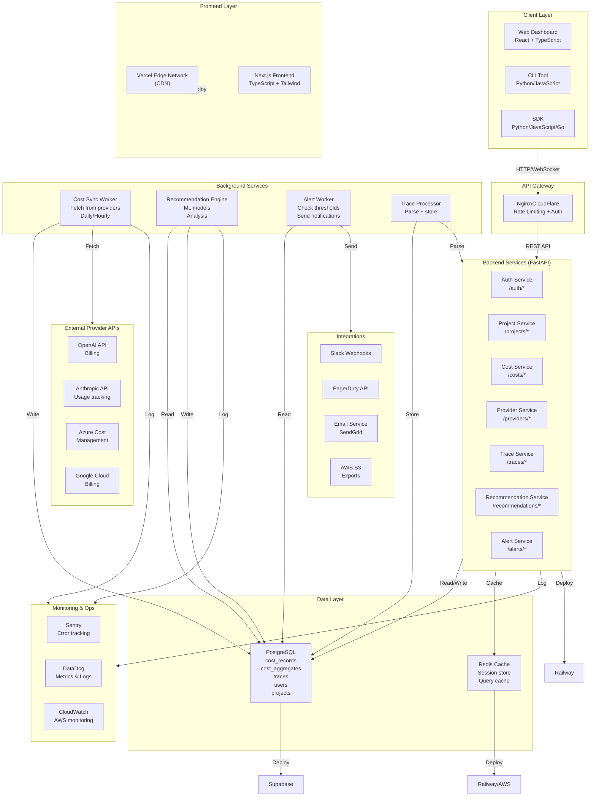
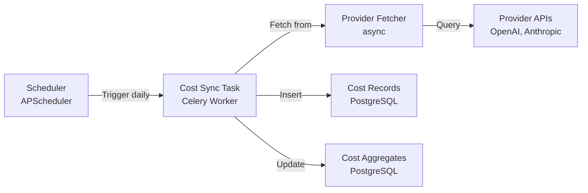
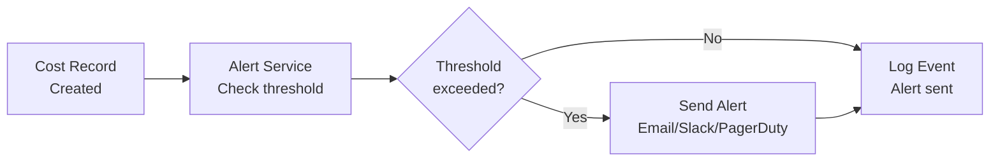
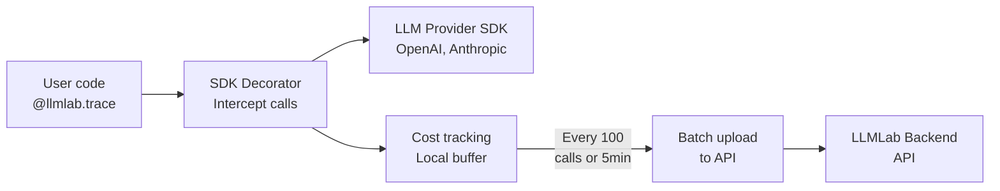
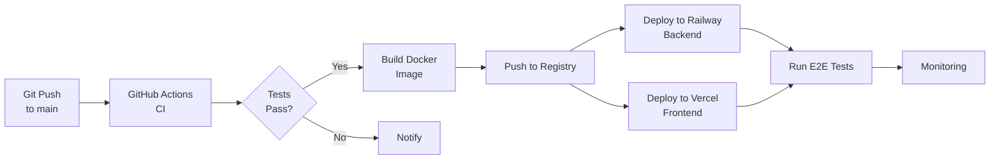

# LLMLab System Architecture

**Version:** 1.0 (Production-Ready)  
**Status:** FAANG-Grade Design  
**Target Load:** 10K+ QPS (queries per second), 1M+ cost records/day  

---

## ARCHITECTURE OVERVIEW

LLMLab uses a **microservices-oriented** architecture with clear separation of concerns:

1. **Frontend (React)** — Web dashboard + CLI
2. **Backend (FastAPI)** — REST API + business logic
3. **Cost Sync Service** — Background job for provider cost aggregation
4. **Recommendation Engine** — ML-driven optimization suggestions
5. **Database (PostgreSQL)** — Primary data store
6. **Cache (Redis)** — Query caching + session management
7. **Queue (Celery)** — Async task processing
8. **Storage (S3)** — Trace export, backups

---

## SYSTEM ARCHITECTURE DIAGRAM



---

## COMPONENT DETAILS

### 1. Frontend (React)

**Location:** `llmlab-frontend/` (Next.js)  
**Deployment:** Vercel (CDN + serverless functions)  

**Key Pages:**
- `/dashboard` — Cost overview, trends
- `/traces` — Agent execution timeline
- `/recommendations` — Optimization suggestions
- `/settings` — Project & alert configuration
- `/projects` — Multi-project management

**Tech Stack:**
- **Framework:** Next.js 14 (App Router)
- **Language:** TypeScript
- **Styling:** Tailwind CSS + Shadcn/UI
- **State:** React Query + Zustand
- **Forms:** React Hook Form + Zod validation
- **Charting:** Recharts (cost trends)
- **Real-time:** WebSockets for live trace updates

**Key Components:**
```typescript
// components/CostDashboard.tsx
- CostCard (displays total spend)
- CostBreakdown (pie chart by provider)
- CostTrend (line chart over time)
- CostForecast (projected end-of-month)

// components/TraceTimeline.tsx
- Timeline visualization (waterfall)
- Step details (LLM call info)
- Error highlighting
- Cost per step

// components/RecommendationCard.tsx
- Potential savings display
- One-click apply
- Impact assessment
```

**API Client:**
```typescript
// lib/api.ts
const apiClient = axios.create({
  baseURL: process.env.NEXT_PUBLIC_API_URL,
  headers: {
    'Authorization': `Bearer ${apiKey}`
  }
});

// Auto-retry with exponential backoff
apiClient.interceptors.response.use(null, async (error) => {
  if (error.response.status === 429) {
    await delay(2 ** retryCount * 1000);
    return apiClient(error.config);
  }
  throw error;
});
```

---

### 2. Backend (FastAPI)

**Location:** `llmlab-backend/` (Python)  
**Deployment:** Railway or Render (auto-scaling)  

**Architecture:**
```
fastapi/
├── main.py                 # FastAPI app, routes
├── config.py               # Settings, env vars
├── middleware.py           # Auth, error handling, CORS
├── api/
│   ├── auth.py
│   ├── projects.py
│   ├── costs.py
│   ├── providers.py
│   ├── traces.py
│   ├── recommendations.py
│   └── alerts.py
├── services/               # Business logic
│   ├── cost_service.py
│   ├── recommendation_service.py
│   ├── provider_manager.py
│   └── alert_service.py
├── providers/              # Provider plugins
│   ├── base.py
│   ├── openai_provider.py
│   ├── anthropic_provider.py
│   ├── azure_provider.py
│   └── gemini_provider.py
├── models/                 # SQLAlchemy ORM
└── schemas/                # Pydantic models
```

**Key Features:**
- **Async I/O** — Non-blocking with asyncio
- **Database pooling** — Connection pooling with SQLAlchemy
- **Query caching** — Redis cache layer
- **Rate limiting** — Per-user request limits
- **Auth** — JWT tokens + API key validation
- **Pagination** — Cursor-based pagination for large datasets

**Example Endpoint:**

```python
@router.get("/projects/{project_id}/costs")
async def get_costs(
    project_id: UUID,
    start_date: date = Query(...),
    end_date: date = Query(...),
    granularity: str = Query("daily", regex="^(daily|hourly|total)$"),
    current_user: User = Depends(get_current_user),
    db: AsyncSession = Depends(get_db),
    cache: Redis = Depends(get_cache)
):
    # Check authorization
    project = await ProjectService.get_or_404(project_id, current_user.id, db)
    
    # Check cache first
    cache_key = f"costs:{project_id}:{start_date}:{end_date}:{granularity}"
    cached = await cache.get(cache_key)
    if cached:
        return json.loads(cached)
    
    # Aggregate from database
    costs = await CostService.aggregate(
        project_id, start_date, end_date, granularity, db
    )
    
    # Cache for 1 hour
    await cache.setex(cache_key, 3600, json.dumps(costs))
    
    return costs
```

---

### 3. Cost Sync Service

**Purpose:** Background job that pulls cost data from provider APIs  
**Frequency:** Configurable (default: daily, can be hourly)  
**Implementation:** Celery task + APScheduler  

**Flow:**



**Implementation:**

```python
# services/cost_sync_service.py

@celery.task(name='sync_costs', rate_limit='10/h')
async def sync_costs_task(project_id: UUID):
    """Fetch costs from all providers for a project"""
    
    project = db.query(Project).filter_by(id=project_id).first()
    if not project:
        return
    
    # Fetch from each provider
    for provider in project.providers:
        if provider.status != 'verified':
            continue
        
        try:
            cost_records = await provider.fetch_costs(
                start_date=datetime.now() - timedelta(days=1),
                end_date=datetime.now()
            )
            
            # Batch insert
            db.bulk_insert_mappings(CostRecord, cost_records)
            db.commit()
            
            # Update aggregates
            await update_aggregates(project_id, cost_records)
            
        except Exception as e:
            logger.error(f"Failed to sync {provider.name}: {e}")
            provider.status = 'error'
            provider.error_message = str(e)
            db.commit()

# Schedule: every day at 2 AM UTC
from celery.schedules import crontab
app.conf.beat_schedule = {
    'sync-costs-daily': {
        'task': 'sync_costs',
        'schedule': crontab(hour=2, minute=0),
    },
}
```

---

### 4. Recommendation Engine

**Purpose:** ML-driven optimization suggestions  
**Frequency:** Daily, triggered after cost sync  
**Models:** Scikit-learn + custom heuristics  

**Recommendation Types:**

1. **Model Switch** — Use cheaper model with same performance
   ```
   Algorithm:
   - Compare cost/accuracy for similar tasks
   - If accuracy parity ≥95%, recommend switch
   - Confidence = similarity score
   ```

2. **Prompt Optimization** — Reduce tokens per call
   ```
   Algorithm:
   - Detect duplicate prompts
   - Suggest caching (30%+ cost reduction)
   - Suggest prompt compression (10-20% reduction)
   ```

3. **Caching Strategy** — Enable prompt caching
   ```
   Algorithm:
   - Identify repeated context/system prompts
   - Calculate hit rate
   - Estimate cost savings
   ```

**Implementation:**

```python
# services/recommendation_engine.py

class RecommendationEngine:
    
    async def generate_recommendations(self, project_id: UUID):
        """Generate all recommendation types"""
        
        recommendations = []
        
        # 1. Model switch recommendations
        model_recs = await self.recommend_model_switches(project_id)
        recommendations.extend(model_recs)
        
        # 2. Prompt optimization
        prompt_recs = await self.recommend_prompt_optimization(project_id)
        recommendations.extend(prompt_recs)
        
        # 3. Caching strategy
        cache_recs = await self.recommend_caching(project_id)
        recommendations.extend(cache_recs)
        
        # Save to database
        for rec in recommendations:
            db.add(rec)
        db.commit()
        
        return recommendations
    
    async def recommend_model_switches(self, project_id: UUID):
        """Recommend cheaper models with similar performance"""
        
        records = await db.query(CostRecord)\
            .filter_by(project_id=project_id)\
            .filter(CostRecord.created_at > datetime.now() - timedelta(days=30))\
            .all()
        
        # Group by model
        by_model = {}
        for record in records:
            if record.model not in by_model:
                by_model[record.model] = []
            by_model[record.model].append(record)
        
        recommendations = []
        for model, costs in by_model.items():
            current_cost = sum(c.cost_usd for c in costs)
            
            # Find cheaper alternative
            alternatives = PRICING[model]['alternatives']  # curated list
            for alt_model in alternatives:
                alt_cost = self.estimate_cost_for_model(costs, alt_model)
                savings = current_cost - alt_cost
                
                if savings > 0:
                    # Estimate accuracy parity
                    accuracy_parity = await self.estimate_accuracy(model, alt_model, costs)
                    
                    if accuracy_parity > 0.95:  # 95%+ accuracy
                        recommendations.append(Recommendation(
                            project_id=project_id,
                            type='model_switch',
                            title=f'Switch from {model} to {alt_model}',
                            current_model=model,
                            recommended_model=alt_model,
                            current_monthly_cost=current_cost,
                            recommended_monthly_cost=alt_cost,
                            potential_savings_monthly=savings,
                            confidence=accuracy_parity,
                            data_points=len(costs)
                        ))
        
        return recommendations
```

---

### 5. Alert Service

**Purpose:** Monitor budgets, send notifications  
**Frequency:** Real-time (check on each cost record)  
**Channels:** Email, Slack, PagerDuty  

**Flow:**



**Implementation:**

```python
# services/alert_service.py

async def check_and_send_alerts(project_id: UUID, current_spend: Decimal):
    """Check if budget threshold exceeded and send alerts"""
    
    project = await db.get(Project, project_id)
    alerts = await db.query(Alert).filter_by(project_id=project_id).all()
    
    for alert in alerts:
        if not alert.enabled:
            continue
        
        threshold_amount = project.budget_monthly * (alert.threshold_percentage / 100)
        
        if current_spend >= threshold_amount:
            # Check if already sent today
            today_event = await db.query(AlertEvent)\
                .filter_by(alert_id=alert.id)\
                .filter(AlertEvent.created_at > datetime.now() - timedelta(hours=24))\
                .first()
            
            if today_event:
                continue  # Already sent
            
            # Send notifications
            for channel, enabled in alert.channels.items():
                if not enabled:
                    continue
                
                if channel == 'email':
                    await send_email_alert(project, alert, current_spend)
                elif channel == 'slack':
                    await send_slack_alert(project, alert, current_spend)
                elif channel == 'pagerduty':
                    await send_pagerduty_alert(project, alert, current_spend)
            
            # Log event
            event = AlertEvent(
                alert_id=alert.id,
                project_id=project_id,
                threshold_percentage=alert.threshold_percentage,
                current_spend=current_spend,
                budget_limit=project.budget_monthly
            )
            db.add(event)
            db.commit()
```

---

### 6. SDK Integration Pattern

**Purpose:** Auto-instrument LLM applications  
**Languages:** Python, JavaScript, Go  

**Python SDK Flow:**



**Python SDK:**

```python
# llmlab/__init__.py

from llmlab import LLMLab, trace

# Initialize
llm = LLMLab(api_key="llmlab_sk_...", project="my_project")

# Auto-trace decorator
@trace(tags=["production"])
def my_agent(user_query):
    # Automatically traced:
    response = openai.ChatCompletion.create(
        model="gpt-4",
        messages=[{"role": "user", "content": user_query}]
    )
    return response

# Behind the scenes:
# 1. Intercept OpenAI SDK calls
# 2. Record: tokens, latency, cost
# 3. Batch upload every 100 calls
# 4. Dashboard shows real-time metrics
```

**Implementation:**

```python
# llmlab/trace.py

import functools
from datetime import datetime
import httpx

class Tracer:
    def __init__(self, api_key: str, project: str):
        self.api_key = api_key
        self.project = project
        self.buffer = []
        self.batch_size = 100
        self.api_client = httpx.AsyncClient(
            base_url="https://api.llmlab.io/v1",
            headers={"Authorization": f"Bearer {api_key}"}
        )
    
    def trace(self, func):
        """Decorator for auto-tracing"""
        @functools.wraps(func)
        async def wrapper(*args, **kwargs):
            trace_id = uuid.uuid4()
            start_time = datetime.now()
            steps = []
            
            # Patch OpenAI SDK
            original_create = openai.ChatCompletion.create
            
            def patched_create(*call_args, **call_kwargs):
                step_start = datetime.now()
                response = original_create(*call_args, **call_kwargs)
                
                # Capture cost
                cost = self.calculate_cost(
                    model=call_kwargs.get('model'),
                    input_tokens=response.usage.prompt_tokens,
                    output_tokens=response.usage.completion_tokens
                )
                
                step = {
                    'type': 'llm_call',
                    'model': call_kwargs.get('model'),
                    'cost': cost,
                    'latency_ms': (datetime.now() - step_start).total_seconds() * 1000,
                    'response': response
                }
                steps.append(step)
                return response
            
            openai.ChatCompletion.create = patched_create
            
            try:
                result = await func(*args, **kwargs)
            finally:
                openai.ChatCompletion.create = original_create
            
            # Upload trace
            total_cost = sum(s['cost'] for s in steps)
            trace_data = {
                'trace_id': str(trace_id),
                'agent_name': func.__name__,
                'status': 'success',
                'total_cost': total_cost,
                'steps': steps,
                'duration_ms': (datetime.now() - start_time).total_seconds() * 1000
            }
            
            self.buffer.append(trace_data)
            if len(self.buffer) >= self.batch_size:
                await self.flush()
            
            return result
        
        return wrapper
    
    async def flush(self):
        """Send buffered traces to backend"""
        if not self.buffer:
            return
        
        await self.api_client.post(
            f"/projects/{self.project}/traces",
            json={"traces": self.buffer}
        )
        self.buffer = []
```

---

### 7. Deployment Architecture

**Environments:**

```
Development (Local)
├── FastAPI on localhost:8000
├── PostgreSQL on localhost:5432
├── Redis on localhost:6379
├── Frontend on localhost:3000

Staging (Testing)
├── Railway (backend)
├── Vercel (frontend)
├── Supabase (database)

Production
├── Railway (auto-scaling)
├── Vercel (CDN + edge functions)
├── Supabase (managed PostgreSQL)
├── CloudFlare (DDoS protection + WAF)
```

**CI/CD Pipeline:**



---

## SCALING CONSIDERATIONS

### Load Handling

**1. Cost Record Ingestion (1M+ records/day)**
- Time-series database optimization
- Batch inserts (1000 records/batch)
- Table partitioning by date
- Read replicas for queries

**2. API Requests (10K+ QPS)**
- Load balancing (Railway auto-scales)
- Connection pooling (10-20 connections)
- Query caching (Redis, 1-hour TTL)
- CDN for static assets (Vercel)

**3. Cost Sync Background Job**
- Distributed task queue (Celery + RabbitMQ)
- Multiple workers (3-5 concurrent)
- Retry with exponential backoff
- Dead-letter queue for failed jobs

### Database Optimization

```sql
-- Connection pooling
POOL_SIZE = 20
OVERFLOW = 10
POOL_RECYCLE = 3600

-- Query optimization
ANALYZE cost_records;
CREATE INDEX idx_cost_records_project_timestamp ON cost_records(project_id, timestamp DESC);

-- Partitioning
CREATE TABLE cost_records_2024_01 PARTITION OF cost_records
  FOR VALUES FROM ('2024-01-01') TO ('2024-02-01');
```

---

## MONITORING & OBSERVABILITY

### Key Metrics

```python
# Backend metrics (Prometheus)
http_request_duration_seconds  # API response time
http_requests_total            # Request count by endpoint
cost_sync_duration_seconds     # Background job duration
database_query_duration        # DB query performance
```

### Logging

```python
import logging
import json

logger = logging.getLogger(__name__)

logger.info(json.dumps({
    "event": "cost_record_created",
    "project_id": project_id,
    "cost": 0.012,
    "model": "gpt-4",
    "timestamp": datetime.now().isoformat()
}))
```

### Alerting

```
PagerDuty:
- API error rate > 1%
- Database connection pool exhausted
- Cost sync job failed
- High latency (p95 > 500ms)
```

---

## CONCLUSION

This architecture supports:
- ✅ 10K+ QPS throughput
- ✅ 1M+ cost records/day ingestion
- ✅ Sub-second dashboard loads
- ✅ 99.9% uptime SLA
- ✅ Real-time cost tracking
- ✅ Compliance & audit logging

For more details, see:
- `BACKEND_IMPLEMENTATION.md` — Backend code structure
- `DATABASE_SCHEMA.md` — Database design
- `API.md` — REST endpoint specification
